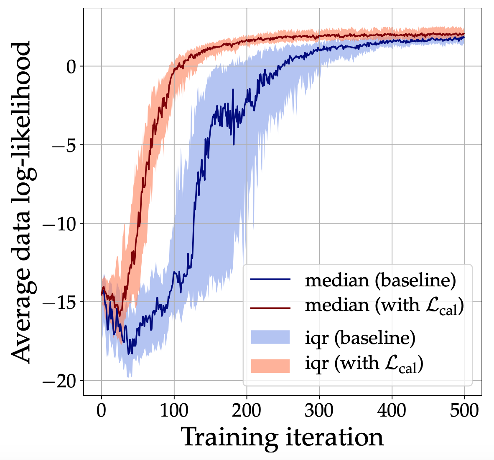

# Calibrated Adversarial Learning

This repository contains the code reproducing the toy regression example presented in Section 5.1. in the paper ["Calibrated Adversarial Refinement for Multimodal Semnatic Segmentation"](https://arxiv.org/abs/2006.13144) by Kassapis et al. 

Check out the [official repositoy](https://github.com/EliasKassapis/CARMSS) for reproducing all semantic segmentation experiments.

## Requirements
The code has been tested with Python 3.7. The required python packages are listed in `requirements.txt`. 

## Overview
Two jupyter notebooks demonstrate the approach of using a calibration network and regularisation to improve conditional GAN sampling. Each is self-sufficient and uses utility code from the `utils` package which defines simple network builders and a data generator. Both notebook are structured as tutorials and contain minimal documentation.

#### Part 1
The notebook `part_1.ipynb` shows visually the effect of the calibration regularisation on the generator, discriminator and the calibration networks in 1-dimensional bimodal regression setup. 

| Calibrated cGAN  | Uncalibrated cGAN with mode collapse |
| ------------- | ------------- |
|   |   |

#### Part 2
The next notebook, `part_2.ipynb` examines the robustness of the approach over multiple data configurations and random weight initialisations. 

<p align="center">
 
</p>

## Citation
```
@article{kassapis2020calibrated,
    title={{Calibrated Adversarial Refinement for Multimodal Semnatic Segmentation}},
    author={Kassapis, Elias and Dikov, Georgi and Gupta, Deepak K. and Nugteren, Cedric},
    journal={arXiv preprint arXiv:2006.13144},
    year={2020}
}
```

## License
Apache License, Version 2.0
